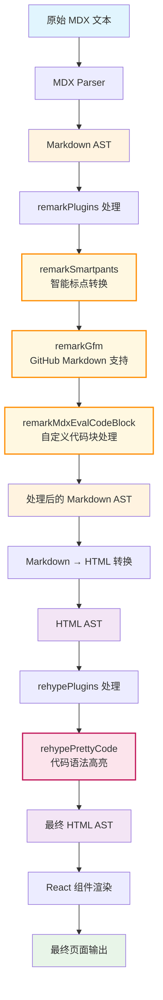

# MDX 处理流程图



## 处理阶段详解

### Remark 阶段（Markdown 处理）
```
原始文本 → Markdown AST → 处理后的 Markdown AST
```

**在你的代码中：**
```typescript
remarkPlugins: [
  remarkSmartpants,        // 智能标点：-- → —, '' → ""
  remarkGfm,              // GitHub 表格、删除线等语法
  [remarkMdxEvalCodeBlock, filename] // 自定义代码块处理
]
```

### Rehype 阶段（HTML 处理）
```
HTML AST → 处理后的 HTML AST → React 组件
```

**在你的代码中：**
```typescript
rehypePlugins: [
  [rehypePrettyCode, {
    theme,                  // 代码主题
    keepBackground: false   // 不保留背景色
  }]
]
```

## 实际效果示例

### 输入 MDX：
```markdown
## 代码示例

这是一个 JavaScript 函数：

```js
function hello() {
  console.log("Hello World!");
}
```

支持 GFM 表格：
| 名称 | 类型 |
|------|------|
| foo  | bar  |
```

### 经过处理后：
1. **remark 阶段**：解析 Markdown 语法，处理表格、代码块
2. **rehype 阶段**：为代码添加语法高亮，生成带样式的 HTML
3. **最终输出**：带有语法高亮的 React 组件

## 插件执行顺序
插件按数组顺序执行，后面的插件会处理前面插件的输出结果。
